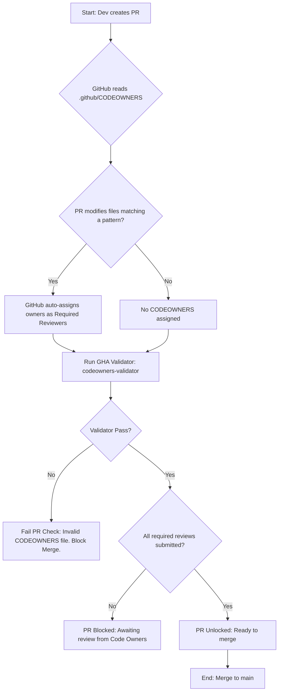
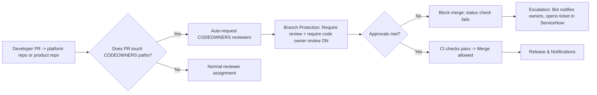

PERPLEXITY

### Confluence Page: Organization-Wide CODEOWNERS Governance and Workflow Design

This document defines how the **CODEOWNERS** mechanism integrates into a **multi-organization DevOps architecture** where a **central GitHub organization** houses reusable CI/CD workflow templates, consumed by **child product organizations**. It establishes governance, setup, enforcement, and maintenance processes for CODEOWNERS across central and application repositories.

***

## 1. Purpose of CODEOWNERS

- Automatically assign reviewers based on file or directory ownership.
- Enforce **accountability** and **review discipline** for critical workflow and application repositories.
- Ensure **mandatory approvals** before merging PRs by integrating with GitHub’s **Branch Protection** and **Actions automation**.[1][2][3]

***

## 2. CODEOWNERS Fundamentals

- The `CODEOWNERS` file maps files or folders to responsible GitHub **teams or users**.
- Locations: `/.github/CODEOWNERS`, `/docs/CODEOWNERS`, or repository root.[2][4]
- Syntax Example:

  ```
  # Complete ownership mapping
  * @central-devops/core-team
  workflows/*.yml @central-devops/devops-engineers
  terraform/** @central-devops/iac-admins
  ansible/** @central-devops/ops-admins
  ```

- Once configured, the defined owners **automatically receive review requests** for every PR affecting their files.[5][6]

***

## 3. Configuration Process Flow

| Step | Task | Responsible Role | Description |
|------|------|------------------|--------------|
| 1 | Create `.github/CODEOWNERS` | Repo Admin | Add mapping for files/directories to responsible teams |
| 2 | Commit and push to `main` | Repo Maintainer | Commit via controlled PR merged after approval |
| 3 | Enable Branch Protection | Org Admin | Enable “Require review from Code Owners” |
| 4 | Integrate with GitHub Actions | DevOps Lead | Add CODEOWNERS approval check workflow (see below) |
| 5 | Automate Notifications | Org Admin | Configure Slack/MS Teams alerts for review requests |

***

## 4. Enforcement and Automation Design

### GitHub Branch Protection Integration

Set branch protection with:
- Require **pull requests before merging**
- Require **review from Code Owners**
- Require **status checks passed** (CI results)
- Restrict **who can push to protected branches**.[7][8]

### GitHub Actions Example: CODEOWNERS Multi-Approval Check

```yaml
name: "Codeowners Approval Check"
on:
  pull_request_review:
    types: [submitted]
jobs:
  verify-codeowners:
    runs-on: ubuntu-latest
    steps:
      - name: Enforce multi-owner approval
        uses: noamelf/codeowner-multi-approval-action@main
        with:
          pr-number: ${{ github.event.pull_request.number }}
          repo-name: ${{ github.repository }}
          github-token: ${{ secrets.ORG_TOKEN }}
```

This ensures **all assigned owners** approve changes before merging.[9]

***

## 5. Maintenance and Change Process

| Activity | Trigger | Responsible | Description |
|-----------|----------|-------------|--------------|
| Add/remove owners | Team reorganization | Central DevOps | Update CODEOWNERS and communicate via ServiceNow |
| Validate ownership accuracy | Quarterly audit | Configuration Governance | Verify coverage and accuracy vs. directory structure |
| Enforce format consistency | Policy enforcement Action | SRE Team | Run YAML linter on file commits |

***

## 6. Governance and RACI Matrix

| Activity | Central DevOps | Product Team | Org Admin | Compliance |
|-----------|----------------|--------------|------------|-------------|
| Define CODEOWNERS policy | R | C | A | I |
| Maintain CODEOWNERS file (central repo) | A | C | R | I |
| Maintain CODEOWNERS (app repos) | C | A | R | I |
| Approve PRs via CODEOWNERS | A | A | I | I |
| Audit and compliance checks | R | C | A | R |

***

## 7. Recommended Best Practices

- Keep one CODEOWNERS file per repo branch to differentiate release or environment-specific ownership.[2]
- Map ownership **at the directory or domain level** (e.g., `terraform`, `helm`, `ansible`).
- Use **organization-level teams** instead of individual usernames for long-term maintainability.[10][5]
- Enforce via **Branch Protection + CODEOWNERS + GitHub Actions** (triplet model).
- Integrate **Slack notifications** for pending reviews for transparency.[6]
- For large teams, use **nested teams** for hierarchical ownership control.[10]

***

## 8. Diagram: CODEOWNERS Governance and Review Process
(see the generated image above)

***

## 9. Integration in CI/CD Template Architecture

- Central org repositories: CODEOWNERS ensures changes to reusable workflows are only approved by **DevOps Architects**.
- Application repositories: product-level CODEOWNERS ensure that app leads review modifications before workflow usage.
- Combined with branch protection and tagging, this creates a **controlled release funnel** for new template versions.[3]

***

## 10. Contingency and Future Enhancements

- **Contingency:** Mirror CODEOWNERS validation with nightly scan workflows to detect missing mappings.
- **Future Enhancements:**
  - Integrate CODEOWNERS-to-ServiceNow CMDB sync for ownership traceability.
  - Automated report of *unreviewed* or *ownership-orphaned* directories.
  - Implement GitHub App to enforce centralized CODEOWNERS schema replication across child organizations.

***

### Summary

The CODEOWNERS strategy enforces consistent review discipline, minimizes governance risks, and accelerates controlled CI/CD evolution across large-scale GitHub architectures. It forms a critical layer of your DevOps governance model alongside workflows, branching strategies, and ServiceNow integration.[1][3][5]

[1](https://dev.to/eunice-js/a-comprehensive-guide-to-codeowners-in-github-22ga)
[2](https://docs.github.com/en/enterprise-server@3.1/repositories/managing-your-repositorys-settings-and-features/customizing-your-repository/about-code-owners)
[3](https://www.aviator.co/blog/code-reviews-at-scale/)
[4](https://docs.github.com/en/enterprise-cloud@latest/repositories/managing-your-repositorys-settings-and-features/customizing-your-repository/about-code-owners)
[5](https://ubiminds.com/en-us/pros-and-cons-github-codeowners/)
[6](https://blog.pullnotifier.com/blog/how-to-automatically-assign-reviewers-in-github)
[7](https://graphite.dev/guides/github-branch-protection-rules)
[8](https://docs.github.com/repositories/configuring-branches-and-merges-in-your-repository/managing-protected-branches/about-protected-branches)
[9](https://github.com/marketplace/actions/codeowners-multi-approval-check)
[10](https://blog.gitguardian.com/best-practices-for-managing-developer-teams-in-github-orgs/)
[11](https://graphite.dev/guides/managing-github-organizations)
[12](https://graphite.dev/guides/code-ownership-best-practices)
[13](https://www.harness.io/blog/mastering-codeowners)
[14](https://www.reddit.com/r/github/comments/11no1rx/codeowners_logic_for_multi_team_approvals/)
[15](https://docs.github.com/en/repositories/configuring-branches-and-merges-in-your-repository/managing-protected-branches/managing-a-branch-protection-rule)
[16](https://graphite.dev/guides/how-to-write-custom-github-actions-for-code-reviews)
[17](https://docs.github.com/en/organizations/collaborating-with-groups-in-organizations/best-practices-for-organizations)
[18](https://www.satellytes.com/blog/post/monorepo-codeowner-github-enterprise/)
[19](https://github.com/marketplace/actions/codeowners-action)
[20](https://stackoverflow.com/questions/75811891/configure-codeowners-for-the-github-organization)


Provide a CODEOWNERS example tailored for central CICD template repos
What branch protection rules should enforce CODEOWNERS in orgs
How to add CI checks in GitHub Actions to validate CODEOWNERS file
Who should own and maintain CODEOWNERS across central and child orgs
Show a RACI matrix for CODEOWNERS, reviews, and enforcement

### CODEOWNERS Configuration and Governance for Centralized CI/CD Template Repositories

This guide establishes **organization-wide governance** for **CODEOWNERS files**, defining how they are configured, enforced, validated, and maintained across **centralized CI/CD template repositories** and **child product organizations**.

***

## 1. CODEOWNERS File Example for Central CICD Template Repositories

A properly structured `CODEOWNERS` file defines responsibility per technology domain:

```
# Global ownership
* @central-org/devops-architects

# CI/CD workflow templates
/.github/workflow-templates/* @central-org/devops-architects @central-org/security-team

# Java reusable templates
/workflows/java/** @central-org/java-ci-maintainers

# .NET reusable templates
/workflows/dotnet/** @central-org/dotnet-ci-maintainers

# Terraform templates
/workflows/terraform/** @central-org/iac-maintainers

# Ansible templates
/workflows/ansible/** @central-org/ops-engineers

# Helm templates
/workflows/helm/** @central-org/platform-ops
```

Features:
- Each sub-path corresponds to a **technology workflow template**.
- Ownership resides in **teams, not individuals**, for governance and continuity.
- Security and governance teams co-own **sensitive areas** like CI/CD YAML or credential templates.[1][2]

***

## 2. Branch Protection Rules for Enforcing CODEOWNERS

Branch protection ensures that all merges to key branches (e.g., `main`, `templates-release/*`) require CODEOWNERS approval. Recommended configuration:

| Setting | Description | Value |
|----------|--------------|-------|
| Require pull request before merging | Disables direct push to main branches | Enabled |
| Require review from CODEOWNERS | Enforces CODEOWNERS approval on all PRs | Enabled |
| Require status checks to pass | Enforces CI success before merge | Required |
| Require signed commits | Ensures verified commits | Enabled |
| Restrict who can push | Limits direct push to Central DevOps Admins | Restricted |
| Require conversations resolved | Prevents unresolved thread merges | Enabled |

Applied via **organization-level policy templates** so each new repo inherits best practices.[2][3][4]

***

## 3. CI Validation for CODEOWNERS Integrity using GitHub Actions

### Example 1: Validate Syntax & Coverage

Using Cloud Posse’s validator Action :[5][6]

```yaml
name: Validate CODEOWNERS
on:
  pull_request:
    paths:
      - 'CODEOWNERS'
jobs:
  validate:
    runs-on: ubuntu-latest
    steps:
      - uses: actions/checkout@v4
      - name: Validate CODEOWNERS syntax
        uses: cloudposse/github-action-validate-codeowners@main
```

### Example 2: Check Ownership Coverage

Ensures all files are owned :[7]

```yaml
name: CODEOWNERS Coverage Check
on: [pull_request]
jobs:
  codeowners-check:
    runs-on: ubuntu-latest
    steps:
      - uses: actions/checkout@v4
      - uses: morrislaptop/codeowners-check@v1
        with:
          githubToken: ${{ secrets.GITHUB_TOKEN }}
```

These CI jobs should:
- Run automatically on PRs affecting `.github/`, `CODEOWNERS`, or workflow templates.
- Fail builds if invalid or missing ownership mappings occur.

***

## 4. Ownership and Maintenance Responsibilities

### Central Organization (CICD Template Owners)
- Owns and manages **CI/CD template repositories**.
- Maintains the **global CODEOWNERS standard and governance policy**.
- Defines team roles and propagates them across child organizations.

### Product (Child) Organizations
- Maintain their **repository-level CODEOWNERS** following central policy.
- Request ownership changes or template ownership extensions through **ServiceNow** feature catalog.

***

## 5. RACI Matrix for CODEOWNERS Governance

| Activity | Central DevOps Architects | Product Team Leads | Org Admin | Security Team | Compliance |
|-----------|---------------------------|-------------------|------------|----------------|-------------|
| Define CODEOWNERS policy template | A | C | R | C | I |
| Implement CODEOWNERS in central repos | R | C | A | C | I |
| Maintain CODEOWNERS (child repos) | C | A | R | C | I |
| Review and merge CI/CD template updates | A | C | I | C | I |
| Approve security-sensitive changes | C | I | I | A | R |
| Audit and compliance of CODEOWNERS coverage | R | C | I | C | A |

**Legend:** A – Accountable, R – Responsible, C – Consulted, I – Informed.[8][9]

***

## 6. Diagram: CODEOWNERS Enforcement and Review Lifecycle
(see the generated image above)

***

## 7. Best Practice Summary

- Place `CODEOWNERS` only in *default branch* and monitor modification through PR enforcement.
- Combine **branch protection + CODEOWNERS + validation workflow** as a three-layer governance mechanism.
- Use **GitHub Teams** instead of user references to ensure sustainability.
- Validate CODEOWNERS automatically before merge as part of CI gates.
- Use **centralized policy repository (.github/.yaml templates)** to propagate standard rules across org-level repositories.

***

This structure ensures tightly controlled **review governance**, consistent **DevSecOps compliance**, and traceable responsibility alignment across both **centralized CI/CD templates** and **downstream product repositories**.

[1](https://www.aviator.co/blog/a-modern-guide-to-codeowners/)
[2](https://blog.gitguardian.com/three-mechanisms-to-protect-your-git-repositories/)
[3](https://graphite.dev/guides/github-branch-protection-rules)
[4](https://stackoverflow.com/questions/73086252/github-branch-protection-questions-and-codeowners-file)
[5](https://docs.cloudposse.com/github-actions/library/actions/validate-codeowners/)
[6](https://github.com/cloudposse/github-action-validate-codeowners)
[7](https://github.com/marketplace/actions/codeowners-check)
[8](https://dev.to/teamcamp/raci-matrix-for-developers-clarifying-roles-and-responsibilities-in-complex-projects-ff5)
[9](https://en.wikipedia.org/wiki/Responsibility_assignment_matrix)
[10](https://docs.github.com/actions/writing-workflows/using-workflow-templates)
[11](https://dev.to/eunice-js/a-comprehensive-guide-to-codeowners-in-github-22ga)
[12](https://github.com/readme/guides/sothebys-github-actions)
[13](https://notes.kodekloud.com/docs/GitHub-Actions-Certification/Reusable-Workflows-and-Reporting/Organizations-Templated-workflow)
[14](https://codenteam.com/code-governance-ownership-assessment/)
[15](https://resources.github.com/learn/pathways/automation/essentials/building-a-workflow-with-github-actions/)
[16](https://docs.github.com/articles/about-code-owners)
[17](https://graphite.dev/guides/in-depth-guide-ci-cd-best-practices)
[18](https://graphite.dev/guides/mandatory-pull-request-checks-and-requirements-in-github)
[19](https://gitlab.com/gitlab-org/gitlab/-/issues/288851)
[20](https://docs.gitlab.com/user/project/codeowners/reference/)

###########################################################################
GEMINI

Here is the solution design, presented in a Confluence page format, focusing specifically on the `CODEOWNERS` process as requested.

-----

# **[Solution Design] GitHub CODEOWNERS Strategy for Centralized CI/CD Templates**

| **Status** | Draft |
| :--- | :--- |
| **Owner** | DevOps Solution Architect |
| **Audience** | DevOps Platform Team, Product Engineering Leads, Security & Compliance |
| **Context** | This design supports a federated GitHub model with a central organization for CI/CD templates and child organizations for application development. |

-----

## 1\. Executive Summary

This document outlines the solution design for implementing and governing GitHub's `CODEOWNERS` functionality. This process is critical for maintaining quality, security, and separation of duties in our federated GitHub model.

The `CODEOWNERS` file will be used to **automatically enforce mandatory reviews** from specific, "expert" teams for changes to critical code. This strategy will be applied in two primary scenarios:

1.  **Central Template Organization:** To protect the stability and security of our shared CI/CD workflow templates.
2.  **Child Application Organizations:** To ensure application teams follow best practices and that changes to their *own* pipeline configurations are reviewed by both application leads and the central DevOps team.

This automated governance is a non-negotiable component of our branching strategy and pull request (PR) process.

-----

## 2\. How the `CODEOWNERS` File Works

At its core, the **`CODEOWNERS` file is a simple mapping**. It maps file paths or patterns within a repository to specific GitHub users or teams.

  * **Location:** The file must be placed in one of three locations:
    1.  `.github/CODEOWNERS` (Recommended)
    2.  `docs/CODEOWNERS`
    3.  `CODEOWNERS` (in the root)
  * **Syntax:** The syntax follows `gitignore` patterns.
    ```
    # Pattern           # Owner(s)
    * @my-org/default-reviewers
    /src/java/          @my-org/java-experts
    *.tf                @my-org/infra-squad
    .github/workflows/  @my-org/devops-platform-team
    ```
  * **Action:** When a Pull Request is opened that modifies any file matching a pattern, the specified owners are **automatically added as required reviewers**. The PR **cannot be merged** until at least one owner from *each* matching pattern has submitted an approval.

-----

## 3\. `CODEOWNERS` in the Solution Architecture

The `CODEOWNERS` strategy is tailored for the two different repository types in our solution.

### Scenario A: Central CI/CD Template Organization

These repositories (e.g., `java-workflow-templates`, `terraform-workflow-templates`) are the "crown jewels." A bug here impacts all consumers.

  * **Purpose:** To enforce strict expert review on all template changes.

  * **Configuration (`.github/CODEOWNERS` in *each* template repo):**

      * Owners will be teams *within* the **Central DevOps Platform Team**.
      * We will **always use teams, not individuals**, to decouple the process from specific people.

    <!-- end list -->

    ```
    # Example for `java-workflow-templates` repo

    # Default owner for any file not matched below
    * @central-devops/core-reviewers

    # Specific owners for specific technologies
    /reusable-ci.yml           @central-devops/java-experts
    /reusable-sonar-scan.yml   @central-devops/security-squad

    # CRITICAL: The CODEOWNERS file itself must be protected
    .github/CODEOWNERS         @central-devops/admins
    ```

  * **Process Fit:**

    1.  A DevOps engineer from the platform team wants to add a new security feature to `reusable-sonar-scan.yml`.
    2.  They create a branch (`feature/add-grype-scan`) from `main`.
    3.  They open a PR to merge `feature/add-grype-scan` -\> `main`.
    4.  GitHub automatically reads `.github/CODEOWNERS`, sees the change to `/reusable-sonar-scan.yml`, and adds the `@central-devops/security-squad` team as a **required reviewer**.
    5.  The PR is blocked from merging until that team provides an approval.

### Scenario B: Child Application Organizations

These are the product-specific repositories. Here, the `CODEOWNERS` file enforces a *hybrid* ownership model.

  * **Purpose:** To allow application teams to own their code while ensuring the Central DevOps and Security teams have oversight on pipeline and infrastructure-as-code (IaC) changes.

  * **Configuration (`.github/CODEOWNERS` in *each* app repo):**

      * This file will be part of the standard repository scaffolding provided by the DevOps team.
      * Owners will be a mix of **Product Teams** and **Central DevOps Teams**.

    <!-- end list -->

    ```
    # Example for `payment-service` app repo

    # Product team owns their own application code
    * @product-payment-team/leads
    /src/main/java/com/payment/   @product-payment-team/seniors
    /src/main/java/com/auth/      @product-payment-team/auth-specialists

    # DevOps/Infra/Security own the pipeline and IaC configurations
    .github/workflows/            @product-payment-team/leads @central-devops/support
    *.tf                          @product-payment-team/infra @central-devops/infra-experts
    helm-chart/                   @product-payment-team/infra @central-devops/infra-experts

    # CRITICAL: Protecting the file requires joint approval
    .github/CODEOWNERS            @product-payment-team/leads @central-devops/admins
    ```

  * **Process Fit (How this helps):**

      * **App Dev Change:** A developer changes `/src/main/java/com/payment/`. The `@product-payment-team/seniors` are automatically assigned. The central DevOps team is *not* bothered.
      * **Pipeline Change:** A developer tries to *change the workflow* (e.g., `.github/workflows/cd.yml`) to skip a security step.

    <!-- end list -->

    1.  GitHub automatically assigns *both* `@product-payment-team/leads` (for app-level approval) and `@central-devops/support` (for platform-level approval).
    2.  The PR is blocked. The central DevOps team can review the change and deny it, preventing a violation of the central template's contract. This prevents "Shadow DevOps" and maintains standardization.

-----

## 4\. Configuration and Maintenance

| Aspect | How to Configure / Who Configures & Maintains |
| :--- | :--- |
| **Initial Setup (Central Repos)** | The **Central DevOps Platform Team** is **Accountable** and **Responsible** for creating and populating the `CODEOWNERS` file in all central template repos. |
| **Initial Setup (Child App Repos)** | The **Central DevOps Platform Team** is **Accountable** for *providing* a standard `CODEOWNERS` file as part of the new repository bootstrapping process. The **Product Team Lead** is **Responsible** for populating it with their specific app teams. |
| **Ongoing Maintenance** | The file is a living document. <br> • **Central Repos:** Maintained by the **Central DevOps Platform Team**. <br> • **Child App Repos:** Maintained by the **Product Team Leads**. |
| **Team Management** | All owners (`@my-org/my-team`) **must be GitHub Teams**, not individual users. This is a non-negotiable best practice. Team membership will be managed via our IdP (e.g., Entra ID/Okta). |

-----

## 5\. Applying Restrictions & Governance

A `CODEOWNERS` file is useless if it can be easily bypassed. We will enforce it at multiple levels.

### A. Branch Protection Rules (Mandatory)

This is the primary enforcement mechanism. For the `main` branch (and all release branches, e.g., `release/*`) in *all* repositories:

  * Go to `Settings > Branches > Add rule`.
  * **Rule:** `main`
  * ✅ **Require a pull request before merging.**
      * ✅ **Require approvals:** Set to `1` (or more).
  * ✅ **Require review from Code Owners.**
      * This is the most important setting. If this is checked, GitHub will *enforce* the `CODEOWNERS` file.
  * ✅ **Require status checks to pass before merging.**
      * This ensures our validation check (see below) must pass.
  * ✅ **(Recommended) Restrict who can push to matching branches.**
      * Only allow repository admins and specific automation teams.

### B. Protecting the `CODEOWNERS` File Itself

We must prevent malicious or accidental PRs that remove teams from the `CODEOWNERS` file.

  * **Solution:** We use the `CODEOWNERS` file to protect *itself*.

  * **Action:** In every `CODEOWNERS` file, the *last line* must be:

    ```
    # In Central Repos
    .github/CODEOWNERS    @central-devops/admins

    # In Child App Repos
    .github/CODEOWNERS    @product-team/leads @central-devops/admins
    ```

  * **Result:** Any PR that attempts to change this file will now require approval from the *highest level* of administrators, ensuring governance is maintained.

### C. GitHub Actions Validation Check

To prevent syntax errors or references to non-existent teams, we will add a *mandatory status check* to all PRs. This check validates the `CODEOWNERS` file.

  * **Tool:** We will use a marketplace action like `mszep/codeowners-validator`.

  * **Implementation:** This check will be part of a `repo-linting.yml` reusable workflow that is *called* by the default PR validation workflow in all repositories.

  * **LLD: Workflow Snippet (`validate-codeowners.yml`)**

    ```yaml
    name: 'Validate CODEOWNERS'
    on:
      pull_request:
        paths:
          - '.github/CODEOWNERS'
        types: [opened, synchronize]

    jobs:
      validate:
        runs-on: ubuntu-latest
        steps:
          - name: 'Checkout code'
            uses: actions/checkout@v4

          - name: 'Run CODEOWNERS Validator'
            uses: mszep/codeowners-validator@v0.8.0
            with:
              # Checks that syntax is valid and all owners are valid (exist)
              checks: 'syntax,files,users,teams'
              github_token: ${{ secrets.GITHUB_TOKEN }}
    ```

  * This job **must be added as a required status check** in the branch protection rules. If the file is invalid, the PR is blocked.

-----

## 6\. Process Diagram: PR Flow with `CODEOWNERS`



-----

## 7\. RACI Matrix: `CODEOWNERS` Process Management

| Task | Central DevOps Team | Product Team Leads | Product Developers | Security Team |
| :--- | :--- | :--- | :--- | :--- |
| **Define** org-wide `CODEOWNERS` policy | **A** (Accountable) | **C** (Consulted) | **I** (Informed) | **C** (Consulted) |
| **Configure** `CODEOWNERS` in *Central Repos* | **R/A** (Responsible/Accountable) | **I** | **I** | **C** |
| **Configure** `CODEOWNERS` in *Child App Repos* | **C** (provides template) | **R/A** | **I** | **C** |
| **Maintain** `CODEOWNERS` in *Central Repos* | **R/A** | **I** | **I** | **C** |
| **Maintain** `CODEOWNERS` in *Child App Repos* | **C** | **R/A** | **I** | **I** |
| **Perform Review** (as an "Owner") | **R** | **R** | **R** | **R** |
| **Maintain GHA Validator** (Action) | **A** | **I** | **I** | **I** |
| **Approve Changes** to `.github/CODEOWNERS` file | **R/A** (for all) | **R** (for their repo) | **I** | **C** |

-----

## 8\. Best Practices Summary

To ensure this solution is successful, all teams must adhere to the following best practices:

  * ✅ **Use Teams, Not Individuals:** Owners **must** be `@org/team-name`. This is our most important rule for process scalability.
  * ✅ **Protect the Protectors:** The `CODEOWNERS` file **must** be included in its *own* file patterns, requiring admin-level approval for changes.
  * ✅ **Enforce via Branch Protection:** The **"Require review from Code Owners"** setting **must** be enabled on all `main` and `release/*` branches.
  * ✅ **Validate the File:** The `codeowners-validator` GitHub Action **must** be a *required status check* on all PRs to prevent broken governance.
  * ✅ **Default Owner:** Every `CODEOWNERS` file **must** include a catch-all (`*`) pattern as the first entry to ensure no file is left without an owner.
  * ✅ **Keep it Updated:** Updating the `CODEOWNERS` file should be part of the "Definition of Done" when a team creates a new microservice, module, or critical directory.

####################################################################
CHAT GPT

Nice — let’s nerd out on **CODEOWNERS** and stitch it explicitly into your centralized GitHub Actions CI/CD design. Below is a Confluence-style page focused entirely on CODEOWNERS: how it works, where it fits in your platform → product org architecture, exact configuration & enforcement patterns, who owns it, automation & checks, reviewer processes, examples, a diagram, a RACI matrix, and recommended best practices and pitfalls.

I searched current authoritative guidance and community experience and cite the most load-bearing sources inline so you can verify details. Key facts (behavior, branch protection interaction, file locations, ordering, team limitations) are documented by GitHub and community maintainers. ([GitHub Docs][1])

---

# Confluence Page: CODEOWNERS — Org-wide policy & process for Platform-CICD / Product Orgs

> **Purpose:** describe the CODEOWNERS policy and operational process for a central GitHub Platform that provides CI/CD templates and product-team repos which consume them. This doc explains how CODEOWNERS enforces review responsibilities, how to configure and maintain it at scale, where to add checks in GitHub Actions, and governance (RACI, SLAs, enforcement automation).

---

## 1 — Quick summary (one-liner)

Use `CODEOWNERS` to automatically request reviewers and (when combined with branch protection) *require* approvals from designated owners for changes to specific paths. Treat CODEOWNERS as a contract between Platform and product teams that enforces review ownership for pipeline templates, security-sensitive files, infra code and shared libraries. ([GitHub Docs][1])

---

## 2 — Core facts you must know (bullet points)

* **Where to place `CODEOWNERS`:** repository root, `.github/` directory, or `docs/` — one file per branch. A `CODEOWNERS` file applies to the branch it lives on (you can have different owners per branch). ([Stack Overflow][2])
* **Syntax & patterns:** `pathpattern    @user @org/team` — supports globbing, `*`, `**`, `!` negation and path specificity. Order matters: *later lines override earlier lines* (i.e., put general rules first, then specific). ([GitHub Docs][1])
* **Teams must be in the same organization:** you cannot reliably reference a team that belongs to a different GitHub organization using `@org/team` across org boundaries. Use people or teams within the owning org. ([GitHub][3])
* **Effect on PRs:** When a PR touches files matched by CODEOWNERS, GitHub will auto-request reviews from the listed owners. If branch protection has **Require review from Code Owners** enabled, at least one approval from any matched owner is required to merge. (If multiple owners are listed, approval by any one owner satisfies the rule.) ([GitHub Docs][4])
* **Limitations:** CODEOWNERS does not by itself enforce multi-owner unanimous approval (approval-by-any-one is default). To require multiple specific approvers you must combine CODEOWNERS with other mechanisms (review rules, bots, or enforced reviewers). Community workarounds exist (see suggested automation). ([GitHub][5])

---

## 3 — How CODEOWNERS fits into your Platform-CICD design (processual view)

Context: `Platform-CICD` org maintains `ci-templates`, `cd-templates`, `shared-actions`. Product org repos call these with `uses:` and provide artifacts (helm/ansible/terraform). CODEOWNERS should be used everywhere but especially on:

* **Platform template repos** (`ci-templates`, `cd-templates`, `shared-actions`): ensure template changes are reviewed by Platform engineers **AND** at least one cross-product reviewer (to validate consumer impact).
* **Product repos:** use CODEOWNERS to protect: `deploy/` (helm/ansible), `infra/` (terraform), `charts/`, `scripts/`, `security/` files, and critical pipeline files (`.github/workflows` references).
* **Central governance repo**: a `platform-repo-ops` or `repo-templates` repo that stores the canonical CODEOWNERS template and sync automation.

Process flow (high level):

1. Developer opens PR to `ci-templates` (or product repo).
2. CODEOWNERS auto-requests owner(s) as reviewers.
3. Branch protection requires: PR checks green + *Require review from Code Owners* satisfied → PR can be merged.
4. If change is breaking, Platform follows release & deprecation process (notify product teams).

(So CODEOWNERS is the primary automatic reviewer assignment and the gate when combined with branch protection.)

---

## 4 — Detailed configuration & recommended contents

### Where to put it

* In **Platform template repos**: put `CODEOWNERS` in `.github/CODEOWNERS` and in repo root for clarity. This file should include:

  * `/.github/workflows/    @platform-ci-team @cross-product-team`
  * `/actions/               @platform-ci-team`
  * `/docs/                 @platform-docs`
  * `/*                     @platform-ci-leads` (catch-all for other changes)
* In **Product repos**: default template from central governance plus repo-specific overrides:

  * `/charts/**             @product-platform-team`
  * `/ansible/**            @product-app-sre`
  * `/terraform/**          @product-infra-team @security`
  * `/.github/workflows/**  @platform-ci-team @product-ci-lead`
* For **branch variants**: create `CODEOWNERS` on `main` and `release/*` branches if ownership differs.

### File sample (Platform `ci-templates`):

```
# .github/CODEOWNERS
# general actions and templates
/.github/workflows/    @platform-ci-team @platform-cross-product
/actions/              @platform-ci-team
/docs/                 @platform-docs
# specific: CI template files
/.github/workflows/java-ci.yml   @java-template-owner
/.github/workflows/helm-deploy.yml @cd-lead
# fallback: anything else -> platform leads
*                      @platform-owners
```

**Notes:** Use team handles (`@org/team`) for maintainability; ensure the team has *write* access to the repo so it can approve PRs.

---

## 5 — Who configures and who maintains CODEOWNERS

| Role                                   | Responsibility                                                                                                                    |
| -------------------------------------- | --------------------------------------------------------------------------------------------------------------------------------- |
| **Platform-CICD Owner (central team)** | Provide canonical CODEOWNERS templates for platform repos; set required branch protection defaults; maintain `platform-repo-ops`. |
| **Repo Owner (product team lead)**     | Adapt canonical template to product repo needs; approve/maintain the product repo CODEOWNERS file.                                |
| **Org Admin / GitHub Admin**           | Apply org-level policies, create teams, set membership and access; enable branch protection enforcement.                          |
| **Platform security / compliance**     | Review CODEOWNERS entries for security sensitive areas (e.g., terraform, secrets handling).                                       |
| **Automation (DevOps Bot/GitHub App)** | Sync canonical CODEOWNERS to selectors; verify presence and run linting; create PRs for updates.                                  |

**Operational rule:** platform team creates and owns the *canonical* template; product teams are responsible for per-repo adjustments. Central team reviews cross-product ownership changes.

---

## 6 — Enforcing CODEOWNERS (rules & tooling)

### Native GitHub controls (recommended primary)

* **Branch protection**: enable `Require pull request reviews before merging` and **check** `Require review from Code Owners`. This blocks merges until a CODEOWNER approves. ([GitHub Docs][4])
* **Require status checks**: add a “codeowners-lint” check to the required checks list so PR merges fail if the CODEOWNERS policy is missing/invalid.
* **Protected branches per repo**: apply to `main`, `release/*`, `prod` branches.

### Automation for scale (must for many repos)

* **Repo template + sync**: store canonical `CODEOWNERS` in `platform-repo-ops` and use a GitHub Action/Script to create/suggest a repo-specific CODEOWNERS via PR to product repos. This gives central control plus product approval.
* **Pre-merge checks (GitHub Actions)**:

  * `codeowners-check` job: validates existence of CODEOWNERS and lints patterns.
  * `codeowners-approval-check` job: ensures PR includes an approval from a CODEOWNER (double-check) — useful if branch protection is not uniformly applied or to provide clearer CI feedback.
* **Bots / GitHub Apps**:

  * Use Probot apps or a custom GH App to auto-assign reviewers, notify on missing owners, escalate when ownership teams are empty.
  * If you need multi-owner unanimous approvals beyond GitHub default (any one owner suffices), implement a bot that enforces rules by checking PR approvals and failing status checks until all required owners approve.

### Example Branch Protection + Checks (process)

* Protect `main` branch:

  * Require PR reviews (1 or more as per org policy)
  * Require review from Code Owners (ON)
  * Require status checks: `ci-tests`, `security-scan`, `codeowners-lint`
  * Require up-to-date branch before merging

---

## 7 — Where to add checks in GitHub Actions (examples)

### A. Lint/validate CODEOWNERS (run on PRs to `.github/CODEOWNERS` or to any PR that touches CODEOWNERS)

```yaml
name: Validate CODEOWNERS
on:
  pull_request:
    paths:
      - '.github/CODEOWNERS'
      - 'CODEOWNERS'
jobs:
  lint:
    runs-on: ubuntu-latest
    steps:
      - uses: actions/checkout@v4
      - name: Codeowners Lint
        uses: redisopensource/codeowners-check@v2
```

*(You can use existing codeowners lint actions from Marketplace or a custom script.)*

### B. Ensure PR has CodeOwner approval (fails PR CI if not)

```yaml
name: Require Codeowner Approval (check)
on: pull_request
jobs:
  require-codeowner:
    runs-on: ubuntu-latest
    steps:
      - uses: actions/checkout@v4
      - name: Check for CODEOWNERS approval
        uses: uweheim/codeowners-approvers-action@v1
        with:
          github_token: ${{ secrets.GITHUB_TOKEN }}
```

*(This creates a status check; combine with branch protection to fail merges.)*

### C. Sync canonical CODEOWNERS to product repos (automation job run from `platform-repo-ops`)

* Workflow in central repo: iterate repos list → create PR adding/updating CODEOWNERS → include governance checklist for product owner to approve.

---

## 8 — Reviewer process & recommended policies

**Reviewer model (recommended for templates repo):**

* **Primary reviewer:** Platform engineer responsible for that template (explicit in `CODEOWNERS`).
* **Secondary reviewer (cross-product):** rotates across product teams and is included in `CODEOWNERS` to ensure consumer perspective.
* **Security reviewer:** for changes touching infra/Terraform/credentials or workflow secrets.
* **Approval rules:**

  * Require at least **2 approvals** for `platform` template changes: one Platform engineer + one cross-product reviewer.
  * Use CODEOWNERS to auto-request reviewers, but configure branch protection rule `Required approving reviewers` = 2 and check `Require review from Code Owners`. (Note: GitHub’s “require review from code owners” is satisfied by any single owner — so to enforce both an owner + an additional approver, configure the required approvals count accordingly.)

**How to guarantee cross-product approver is a CODEOWNER too:**

* Include both `@platform/platform-team` and `@platform/cross-product` in the `CODEOWNERS` line for the template files. Then set `required approving reviewers` to 2 in branch protection. This ensures a code owner plus another owner or reviewer must sign off.

---

## 9 — Org-wide best practices & policy (bullet list)

* **Canonical template repo:** maintain `CODEOWNERS` templates and sync automation in `platform-repo-ops`.
* **Pin teams to responsibilities:** each team must have an owner and alternates (2 people minimum) to avoid blocked PRs. Maintain team membership lists.
* **Team access:** teams named in CODEOWNERS must have *write* permissions on the repo.
* **No cross-org teams:** do not reference teams that live in a different GitHub org; use individual users or invite cross-org members. ([GitHub][3])
* **Limit the number of owners per path:** many owners create noise — prefer 1–3 owners per area.
* **Document review expectations:** SLAs for review response times (e.g., 48 hours for normal items, 4 hours for P1).
* **Monitor stale teams:** automation should detect teams with zero active maintainers and open an org ticket.
* **Treat CODEOWNERS as configuration** — version it, PR changes, and require CHANGELOG entry for ownership changes.
* **Enforce with CI jobs + branch protection** instead of relying solely on human process.
* **Audit & reporting:** build dashboards that show PRs blocked for lack of owner approval, and average owner response time.

---

## 10 — Advanced enforcement patterns & workarounds

* **Want multiple *specific* owners to approve?**
  GitHub default: any one owner satisfies “Require review from Code Owners.” To enforce multiple *named* owners:

  * Option A: Use branch protection `Required approving reviewers` > 1 and list multiple owners in CODEOWNERS (then *any* two owners suffice — not necessarily the two you intended).
  * Option B (strict): Implement a policy bot that checks PR approvers list and fails a status check until all *required* owner accounts have approved. (Custom GitHub App or Actions.)
* **Organization-wide enforcement:** GitHub does not provide a single org CODEOWNERS; use:

  * Repository templates + automated sync from central `platform-repo-ops`, or
  * GitHub Enterprise features / policy settings and an automation pipeline to apply/check `CODEOWNERS` across repos. Community threads recommend bots for enforcement. ([Reddit][6])
* **Reduce notification spam:** owners get auto-requested and subscribed to PRs. If this is noisy, use a bot to add *required* reviewers silently (or use GitHub’s team notification settings); discuss tradeoffs — silent enforcement reduces visibility.

---

## 11 — Diagram (process flow)

Mermaid diagram (paste into mermaid renderer / Confluence mermaid macro):



---

## 12 — RACI matrix (CODEOWNERS operations)

| Activity                                   | Platform-CICD Team | Product Team | GitHub Admin | Security | DevOps Automation |
| ------------------------------------------ | -----------------: | -----------: | -----------: | -------: | ----------------: |
| Create canonical CODEOWNERS templates      |                  A |            C |            I |        C |                 R |
| Add/modify CODEOWNERS in platform repos    |                  R |            C |            I |        C |                 R |
| Add/modify CODEOWNERS in product repos     |                  I |            R |            I |        C |                 R |
| Maintain team memberships                  |                  I |            R |            A |        I |                 C |
| Enforce branch protection settings         |                  A |            C |            R |        C |                 I |
| Lint & validate CODEOWNERS via CI          |                  R |            C |            I |        I |                 A |
| Respond to missing approvals / escalations |                  R |            R |            I |        C |                 A |

Legend: R=Responsible, A=Accountable, C=Consulted, I=Informed.

---

## 13 — Example policies & SLAs to adopt

* **Owner availability SLA:** CODEOWNERS must respond to review requests within **48 hours** (P2), and **4 hours** for P1 (breaking CI on `main`).
* **Owner redundancy:** every CODEOWNER team must have at least **2 active** members.
* **Change notification:** changes to CODEOWNERS entries for platform repos require a release note and notify product teams.
* **Audit cadence:** run org audit monthly to detect repos missing `CODEOWNERS` or teams with zero maintainers.

---

## 14 — Troubleshooting & common gotchas

* **“CODEOWNERS not triggering”:** ensure file is on the branch you're opening the PR against (CODEOWNERS is branch scoped). Also teams must have access and syntax must be correct. ([Stack Overflow][2])
* **Order confusion:** remember the *last matching line wins* — specific rules should appear later in the file. ([GitHub][7])
* **Too many reviewers / noise:** keep owners minimal; use cross-product reviewer rotation to reduce always-subscribed users. See “Reduce notification spam.” ([GitHub][8])
* **Cross-org team references fail:** don’t use teams from other orgs; prefer user accounts or ensure org membership mapping. ([GitHub][3])

---

## 15 — Practical primer: sample workflows & snippets (copy-paste)

### A. Branch protection checklist (admin)

* Protect `main` branch

  * Require PR reviews before merging ✔
  * Require review from Code Owners ✔
  * Require status checks: `ci`, `security`, `codeowners-lint` ✔
  * Require up-to-date branch before merging ✔

### B. CI job: CODEOWNERS lint (YAML)

```yaml
name: codeowners-lint
on:
  pull_request:
    paths:
      - '.github/CODEOWNERS'
      - 'CODEOWNERS'
jobs:
  lint:
    runs-on: ubuntu-latest
    steps:
      - uses: actions/checkout@v4
      - name: Lint CODEOWNERS
        uses: amannn/action-codeowners-lint@v1
```

### C. CI job: require OWNER approval (status check)

```yaml
name: require-codeowner-approval
on: pull_request
jobs:
  check:
    runs-on: ubuntu-latest
    steps:
      - uses: actions/checkout@v4
      - name: Verify CODEOWNERS approval
        uses: nominated/codeowners-approver-check@vX
        with:
          github_token: ${{ secrets.GITHUB_TOKEN }}
```

*(Add `require-codeowner-approval` to branch protection required checks.)*

---

## 16 — Governance & roadmap actions (recommended next steps)

1. Create `platform-repo-ops` with canonical `CODEOWNERS` templates and an Action to sync templates by PR to all repos.
2. Configure branch protection defaults for the org (apply to new repos via repo templates).
3. Build `codeowners-lint` Action and add to required checks on protected branches.
4. Implement a lightweight GitHub App to enforce multi-owner rules if you need more than “any-one owner”.
5. Run a quarterly audit and dashboard for CODEOWNERS coverage & owner responsiveness.

---

## 17 — Citations (authoritative & community references)

* GitHub Docs — *About code owners*. ([GitHub Docs][1])
* GitHub Docs — *Branch protection and Require review from Code Owners* (behaviour & merge blocking). ([GitHub Docs][4])
* GitHub Community — *Order of owners in CODEOWNERS file (last match wins)*. ([GitHub][7])
* GitHub Community — *Team references and cross-org limitations*. ([GitHub][3])
* Industry writeup: *Streamline Code Ownership* (patterns and enforcement recommendations). ([Harness.io][9])

---

## 18 — Closing — Why CODEOWNERS matters for your Platform-CICD

* **Automates reviewer discovery** so the Platform team and product teams are not manually pinged.
* **Provides accountability & auditability** for changes to templates, infra and deployment code.
* **Serves as a lightweight policy enforcement mechanism** when combined with branch protection and CI checks.
* **Enables predictable releases**: changes to templates require the right people to approve, reducing consumer breakage.

If you want, I’ll **next**:

* generate a canonical `CODEOWNERS` template for your `Platform-CICD` repos plus a per-repo example for product repos, or
* create the GitHub Actions workflows referenced above (lint + require-approval + sync action) ready to paste into your `.github/workflows/` directories, or
* draft the `platform-repo-ops` automation script (Python/gh CLI) to sync CODEOWNERS across 100 repos.

Pick one and I’ll produce it immediately (fully worked YAML / script / CODEOWNERS text).

[1]: https://docs.github.com/articles/about-code-owners?utm_source=chatgpt.com "About code owners"
[2]: https://stackoverflow.com/questions/69909404/is-that-possible-that-there-are-multiple-codeowners-files-in-a-repository?utm_source=chatgpt.com "Is that possible that there are multiple codeowners files in a ..."
[3]: https://github.com/orgs/community/discussions/21781?utm_source=chatgpt.com "Add team for CODEOWNERS from other organization · ..."
[4]: https://docs.github.com/en/repositories/configuring-branches-and-merges-in-your-repository/managing-protected-branches/managing-a-branch-protection-rule?utm_source=chatgpt.com "Managing a branch protection rule"
[5]: https://github.com/orgs/community/discussions/22522?utm_source=chatgpt.com "CODEOWNER Required Reviews #22522"
[6]: https://www.reddit.com/r/devops/comments/176ujdz/how_to_enforce_constraints_across_git_repositories/?utm_source=chatgpt.com "How to enforce constraints across Git repositories? : r/devops"
[7]: https://github.com/orgs/community/discussions/23644?utm_source=chatgpt.com "Order of owners in codeowners file #23644"
[8]: https://github.com/orgs/community/discussions/35673?utm_source=chatgpt.com "Enable code ownership without automatic PR notifications ..."
[9]: https://www.harness.io/blog/mastering-codeowners?utm_source=chatgpt.com "Streamline Code Ownership in Your Git Repository"

generate a canonical CODEOWNERS template for your Platform-CICD repos plus a per-repo example for product repos,
draft the platform-repo-ops automation script (Python/gh CLI) to sync CODEOWNERS across 100 repos.

Nice — let’s build two practical deliverables you can drop into `platform-repo-ops` and run:

1. A **canonical CODEOWNERS** file for the central Platform-CICD repos (ready to paste into `.github/CODEOWNERS`).
2. A **per-repo example CODEOWNERS** for product repos (example product repo layout).
3. A production-ready **`platform-repo-ops` automation script** (Python + `gh` CLI + `git`) that will create/update CODEOWNERS across many repos, open PRs, and optionally assign reviewers — with dry-run, logging, retries, and safety checks.

Everything below is copy/paste-ready. Use it, adapt it, or tell me to tailor it to your org/team names and policies.

---

# 1 — Canonical CODEOWNERS (Platform-CICD repos)

Place this in `platform-ci-templates/.github/CODEOWNERS` and `cd-templates/.github/CODEOWNERS` (and `shared-actions/.github/CODEOWNERS`).

```text
# Canonical CODEOWNERS for Platform-CICD repos
# Put this file in .github/CODEOWNERS (and optionally repo root)
# Last matching line wins. Keep specific rules below general catch-all.

# -------------------------
# Core templates & workflows
# -------------------------
# All workflow files (CI + CD) : platform CI team + platform cross-product reviewers
/.github/workflows/**        @platform-org/platform-ci-team  @platform-org/platform-cross-product

# Composite actions (reusable small actions)
actions/**                  @platform-org/platform-ci-team

# Tests and pipeline-tests (E2E for templates)
tests/**                    @platform-org/platform-ci-team  @platform-org/qe

# Docs & Examples
docs/**                     @platform-org/platform-docs

# Security sensitive: infra / secrets patterns inside templates
security/**                 @platform-org/security-team
*.secrets.yml               @platform-org/security-team

# Specific template files (give explicit owners for high-risk templates)
.github/workflows/helm-deploy.yml   @platform-org/cd-lead @platform-org/platform-ci-team
.github/workflows/terraform-apply.yml @platform-org/infra-lead @platform-org/security-team
.github/workflows/java-ci.yml       @platform-org/java-template-owner

# -------------------------
# Catch-all: platform leads
# -------------------------
# Everything else should be owned by platform leads (fallback)
*                           @platform-org/platform-leads
```

**Notes / how to adapt**

* Replace `@platform-org/...` with your actual org/team handles (teams must exist and have write access).
* Keep the list short for noisy paths; prefer 1–3 owners per path.
* Put this file on `main` and any long-term support branches you use (e.g., `release/*`).

---

# 2 — Example CODEOWNERS for a Product Repo

Place in `product-repo/.github/CODEOWNERS`. This is tuned for repos that include app code + charts + ansible + terraform + pipeline references.

```text
# Product repo CODEOWNERS - example
# Designed for product repositories that call Platform-CICD templates

# Application code owners
/src/**                     @product-org/product-dev-team

# Deployment artifacts (helm charts)
/charts/**                  @product-org/product-sre @platform-org/platform-ci-team

# Ansible playbooks (app deployments)
/ansible/**                 @product-org/product-sre @platform-org/platform-ci-team

# Terraform infra code
/terraform/**               @product-org/product-infra @platform-org/security-team

# GitHub Actions workflows that reference central templates
.github/workflows/**        @product-org/product-ci-lead @platform-org/platform-ci-team

# Docs and runbooks
/docs/**                    @product-org/product-docs

# Catch-all fallback (product leads)
*                           @product-org/product-leads
```

**Guidelines**

* `@platform-org/platform-ci-team` is included on `.github/workflows/**` so Platform-CICD gets review requests when pipeline-related files change.
* Product teams should include alternates in their teams (at least 2 people per team) to avoid blocking PRs.

---

# 3 — `platform-repo-ops` automation script (Python + `gh` CLI + `git`)

This script will:

* Read a CSV/JSON list of target repos (org/repo).
* For each repo:

  * Clone the repo (shallow), create a branch `ops/codeowners-sync/<timestamp>`.
  * Add or update `.github/CODEOWNERS` with the canonical content (merge intelligently if file exists).
  * Commit and push branch.
  * Create a PR against `main` (or configured base branch) with title/body.
  * Optionally assign reviewers (product repo owners or platform leads).
  * Optionally label the PR and add checklist comments.
* Supports dry-run, concurrency, retries, logging, and rate-limit sleep.
* Uses `gh` CLI for PR creation and `git` for commits. (Easily adapted to use the REST API directly.)

> Pre-reqs:
>
> * `gh` CLI installed and authenticated with a token that has repo:public_repo or repo scope for private repos.
> * `git` installed.
> * Python 3.9+ with `requests` (optional) and `pyyaml` if you prefer YAML config.
> * The user running the script must have push rights to the target repos or be a GitHub admin (or use a machine user).

Copy the script into `platform-repo-ops/sync_codeowners.py`.

```python
#!/usr/bin/env python3
"""
platform-repo-ops: sync CODEOWNERS file across many repos.

Usage:
  python sync_codeowners.py --repos-file repos.csv --codeowners-file canonical_CODEOWNERS \
    --branch-prefix ops/codeowners-sync --base-branch main --dry-run

repos.csv format (header): org,repo
example:
platform-org,ci-templates
product-org,app-repo-1

Important:
- Requires gh CLI and git available in PATH
- gh must be authenticated: `gh auth login` with token that has repo permission
"""

import argparse
import csv
import subprocess
import sys
import tempfile
import os
import shutil
import datetime
import time
import logging

# CONFIGURABLE
GIT_CLONE_DEPTH = 1
SLEEP_BETWEEN_REPOS = 1.0  # seconds
PR_BODY_TEMPLATE = """Sync canonical CODEOWNERS

This PR was created automatically by platform-repo-ops to sync the canonical CODEOWNERS.
Please review the changes and merge if OK.

If you need to change ownership, update the CODEOWNERS file or raise a ServiceNow request as per org policy.

Automated metadata:
- created-by: platform-repo-ops
- timestamp: {ts}
"""
# End config

logging.basicConfig(level=logging.INFO, format="%(asctime)s %(levelname)s %(message)s")

def run_cmd(cmd, cwd=None, check=True, capture_output=False):
    logging.debug("CMD: %s", " ".join(cmd))
    res = subprocess.run(cmd, cwd=cwd, text=True, capture_output=capture_output)
    if check and res.returncode != 0:
        logging.error("Command failed: %s\nStdout: %s\nStderr: %s", " ".join(cmd), res.stdout, res.stderr)
        raise RuntimeError(f"Command failed: {' '.join(cmd)}")
    return res

def read_repos_csv(path):
    repos = []
    with open(path, newline='') as f:
        reader = csv.DictReader(f)
        for r in reader:
            org = r.get('org') or r.get('organization') or r.get('owner')
            repo = r.get('repo') or r.get('repository') or r.get('name')
            if not org or not repo:
                logging.warning("Skipping malformed row: %s", r)
                continue
            repos.append((org.strip(), repo.strip()))
    return repos

def load_codeowners(path):
    with open(path, 'r', encoding='utf-8') as f:
        return f.read()

def ensure_git_user_configured():
    # Ensure git user is configured to avoid commit errors
    try:
        run_cmd(["git", "config", "--global", "user.email"], check=False)
    except Exception:
        pass

def clone_repo(org, repo, tmpdir, base_branch):
    clone_url = f"https://github.com/{org}/{repo}.git"
    repo_dir = os.path.join(tmpdir, f"{org}__{repo}")
    if os.path.exists(repo_dir):
        shutil.rmtree(repo_dir)
    logging.info("Cloning %s/%s ...", org, repo)
    run_cmd(["git", "clone", "--depth", str(GIT_CLONE_DEPTH), "--branch", base_branch, clone_url, repo_dir])
    return repo_dir

def read_existing_codeowners(repo_dir):
    # prefer .github/CODEOWNERS then CODEOWNERS in root
    paths = [os.path.join(repo_dir, ".github", "CODEOWNERS"), os.path.join(repo_dir, "CODEOWNERS")]
    for p in paths:
        if os.path.exists(p):
            with open(p, 'r', encoding='utf-8') as f:
                content = f.read()
            return p, content
    return None, None

def merge_codeowners(existing_content, canonical_content):
    """
    Simple merge strategy:
    - If existing is None -> return canonical
    - If existing contains a marker block DELIMITED by:
        # BEGIN PLATFORM-CODEOWNERS
        ...
        # END PLATFORM-CODEOWNERS
      then replace that block; otherwise prepend canonical block with markers.
    This allows per-repo customizations to stay below/after the marker.
    """
    BEGIN = "# BEGIN PLATFORM-CODEOWNERS"
    END = "# END PLATFORM-CODEOWNERS"
    block = f"{BEGIN}\n{canonical_content.rstrip()}\n{END}\n\n"
    if not existing_content:
        return block
    if BEGIN in existing_content and END in existing_content:
        before, rest = existing_content.split(BEGIN, 1)
        _, after = rest.split(END, 1)
        merged = f"{before}{block}{after.lstrip()}"
        return merged
    else:
        # Prepend canonical block (preserve existing below)
        return f"{block}{existing_content}"

def write_codeowners(repo_dir, content):
    dest_dir = os.path.join(repo_dir, ".github")
    os.makedirs(dest_dir, exist_ok=True)
    path = os.path.join(dest_dir, "CODEOWNERS")
    with open(path, "w", encoding="utf-8") as f:
        f.write(content)
    return path

def create_branch_and_push(repo_dir, branch_name):
    run_cmd(["git", "checkout", "-b", branch_name], cwd=repo_dir)
    run_cmd(["git", "add", ".github/CODEOWNERS"], cwd=repo_dir)
    run_cmd(["git", "commit", "-m", "chore: sync canonical CODEOWNERS [automated]"], cwd=repo_dir)
    run_cmd(["git", "push", "--set-upstream", "origin", branch_name], cwd=repo_dir)

def create_pr_with_gh(org, repo, branch, base_branch, title, body, reviewers=None, labels=None):
    repo_ref = f"{org}/{repo}"
    cmd = ["gh", "pr", "create", "--repo", repo_ref, "--head", branch, "--base", base_branch, "--title", title, "--body", body]
    if labels:
        cmd += ["--label", ",".join(labels)]
    logging.info("Creating PR for %s/%s branch=%s", org, repo, branch)
    res = run_cmd(cmd, capture_output=True)
    pr_output = res.stdout.strip()
    logging.debug("PR output: %s", pr_output)
    if reviewers:
        # assign reviewers
        try:
            run_cmd(["gh", "pr", "review-request", "--repo", repo_ref, "--reviewer", ",".join(reviewers), pr_output], check=False)
        except Exception as e:
            logging.warning("Failed to request reviewers via gh CLI: %s", e)
    return pr_output

def process_repo(org, repo, canonical_codeowners, dry_run, base_branch, branch_prefix, reviewers, labels):
    ts = datetime.datetime.utcnow().strftime("%Y%m%dT%H%M%SZ")
    tmpdir = tempfile.mkdtemp(prefix=f"sync_codeowners_{org}_{repo}_")
    try:
        repo_dir = clone_repo(org, repo, tmpdir, base_branch)
    except Exception as e:
        logging.error("Failed to clone %s/%s: %s", org, repo, e)
        shutil.rmtree(tmpdir, ignore_errors=True)
        return False
    try:
        existing_path, existing = read_existing_codeowners(repo_dir)
        merged = merge_codeowners(existing, canonical_codeowners)
        if existing and merged.strip() == existing.strip():
            logging.info("No changes required for %s/%s (CODEOWNERS unchanged).", org, repo)
            shutil.rmtree(tmpdir, ignore_errors=True)
            return True
        if dry_run:
            logging.info("[DRY RUN] Would update CODEOWNERS for %s/%s. Existing file: %s", org, repo, existing_path)
            # Optionally write preview to logs
            logging.debug("Merged content:\n%s", merged)
            shutil.rmtree(tmpdir, ignore_errors=True)
            return True
        # write new CODEOWNERS
        dest_path = write_codeowners(repo_dir, merged)
        branch = f"{branch_prefix}/{ts}"
        ensure_git_user_configured()
        create_branch_and_push(repo_dir, branch)
        title = f"[ops] Sync canonical CODEOWNERS - {ts}"
        body = PR_BODY_TEMPLATE.format(ts=ts)
        pr = create_pr_with_gh(org, repo, branch, base_branch, title, body, reviewers=reviewers, labels=labels)
        logging.info("Created PR: %s for %s/%s", pr, org, repo)
        time.sleep(SLEEP_BETWEEN_REPOS)
        return True
    except Exception as e:
        logging.exception("Error processing %s/%s: %s", org, repo, e)
        return False
    finally:
        shutil.rmtree(tmpdir, ignore_errors=True)

def main():
    parser = argparse.ArgumentParser(description="Sync CODEOWNERS across repos")
    parser.add_argument("--repos-file", required=True, help="CSV file with columns: org,repo")
    parser.add_argument("--codeowners-file", required=True, help="Canonical CODEOWNERS file path")
    parser.add_argument("--base-branch", default="main", help="Base branch to open PRs against")
    parser.add_argument("--branch-prefix", default="ops/codeowners-sync", help="Branch prefix for sync branches")
    parser.add_argument("--dry-run", action="store_true", help="Perform a dry run (no pushes/PRs)")
    parser.add_argument("--reviewers", help="Comma separated list of reviewers to request on PRs (e.g. platform-org/platform-leads)")
    parser.add_argument("--labels", help="Comma separated labels to add to PRs")
    args = parser.parse_args()

    repos = read_repos_csv(args.repos_file)
    canonical = load_codeowners(args.codeowners_file)
    reviewers = args.reviewers.split(",") if args.reviewers else None
    labels = args.labels.split(",") if args.labels else None

    logging.info("Starting sync for %d repos (dry_run=%s)", len(repos), args.dry_run)
    success = 0
    for org, repo in repos:
        try:
            ok = process_repo(org, repo, canonical, args.dry_run, args.base_branch, args.branch_prefix, reviewers, labels)
            if ok:
                success += 1
        except Exception as e:
            logging.exception("Unhandled error for %s/%s: %s", org, repo, e)
    logging.info("Completed sync. Success: %d/%d", success, len(repos))

if __name__ == "__main__":
    main()
```

---

## Usage examples

1. Create a `repos.csv` file:

```csv
org,repo
platform-org,ci-templates
platform-org,cd-templates
platform-org,shared-actions
product-org,app-repo-1
product-org,app-repo-2
```

2. Create your canonical file `canonical_CODEOWNERS` (use the canonical template above).

3. Run in dry run:

```bash
python sync_codeowners.py --repos-file repos.csv --codeowners-file canonical_CODEOWNERS --dry-run
```

4. Run for real (requests reviewers and labels PRs):

```bash
python sync_codeowners.py --repos-file repos.csv --codeowners-file canonical_CODEOWNERS \
  --reviewers "platform-org/platform-leads,platform-org/platform-ci-team" \
  --labels "ops-sync,codeowners" \
  --base-branch main
```

---

## Operational notes, hardening & best practices

* **Permissions:** `gh` must be authenticated with a token that can create branches and PRs. For private repos use a machine user token or org-level app with scoped permissions.
* **Safety:** The script creates a branch per run using timestamp. This avoids collisions and makes it easy to track PRs.
* **Merge policy:** PRs created by this automation should be reviewed by the product repo owners before merge. Consider a separate branch protection rule that prevents merging automation PRs without approvals.
* **Idempotency:** The merge strategy places a `BEGIN/END PLATFORM-CODEOWNERS` block. This lets teams keep local customizations outside the block. If you prefer full replacement, change merge logic accordingly.
* **Retries & rate limits:** This simple script has no backoff for API rate limits. If you sync hundreds of repos, add retry/backoff around `gh` commands and `git push`. You can detect GitHub rate limit errors from `gh` output.
* **Audit & logging:** Persist logs to a storage location and produce a final report listing created PR URLs (extend `create_pr_with_gh` to capture returned PR URL).
* **PR templates:** Use a PR template that documents the ownership change reason and links to ServiceNow request if required.
* **Testing:** Run dry-run in a sandbox org before production. Test with one product repo to validate team names and access.
* **Automation scheduling:** Run this script nightly or weekly and create an internal dashboard that shows repos lacking CODEOWNERS or having empty ownership teams.
* **Security:** Keep the canonical file in a protected repo (`platform-repo-ops`) with controlled permissions. Use branch protection on that repo.

---

## Troubleshooting tips

* If `gh pr create` fails: ensure `gh` is authenticated (`gh auth status`) and the token has `repo` permission.
* If `git clone` for a repo fails with permission error: check repo visibility and token scopes.
* If reviewers cannot be requested: ensure reviewer teams exist and are mentionable in the target repo (team must belong to the same org or be visible).
* If CODEOWNERS not applied in PRs: ensure the file is on the target branch (`main`) and branch protection setting `Require review from Code Owners` is enabled.

---

## Next steps I can do for you (pick one)

* Tailor the canonical CODEOWNERS with your actual team handles (give me your org/team names).
* Add a feature to the script: generate a summary CSV of created PR URLs and statuses.
* Convert the script to use the GitHub REST API (requests/pygithub) instead of `gh` CLI.
* Create GitHub Actions workflows for `platform-repo-ops` to run the sync on schedule and open a Slack digest.

Which would you like next?
